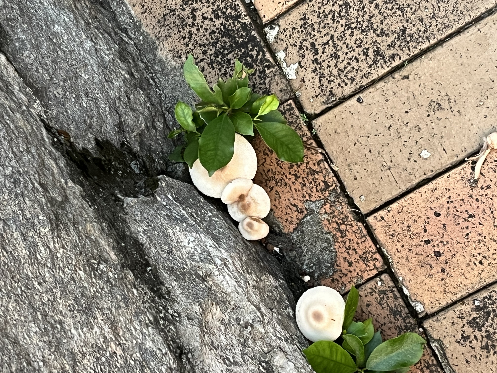
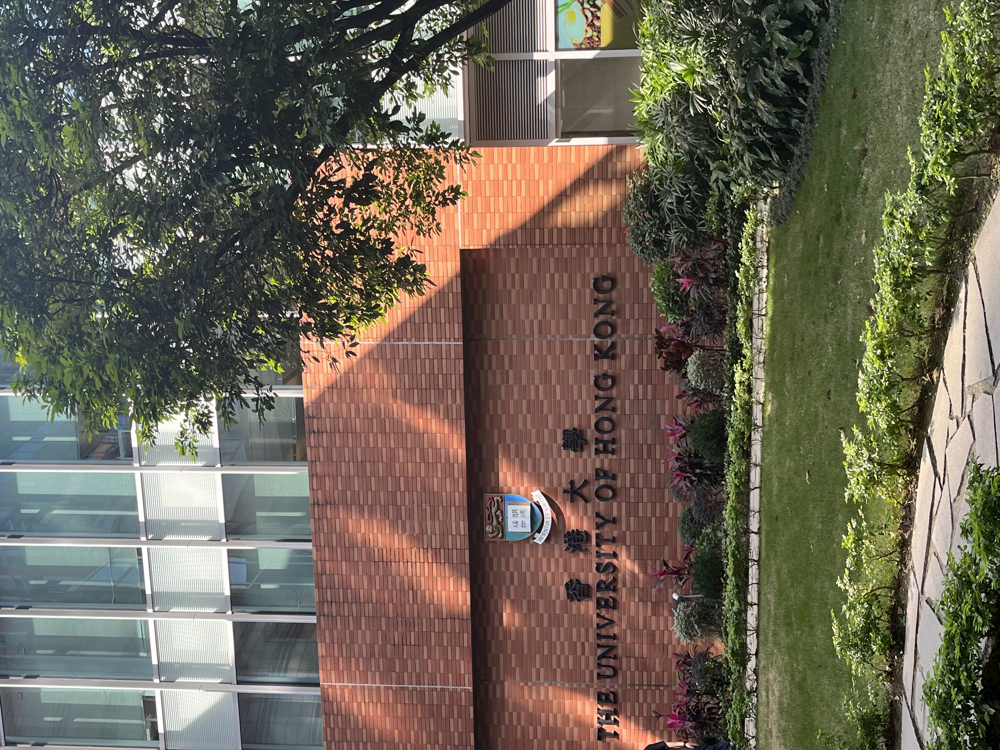
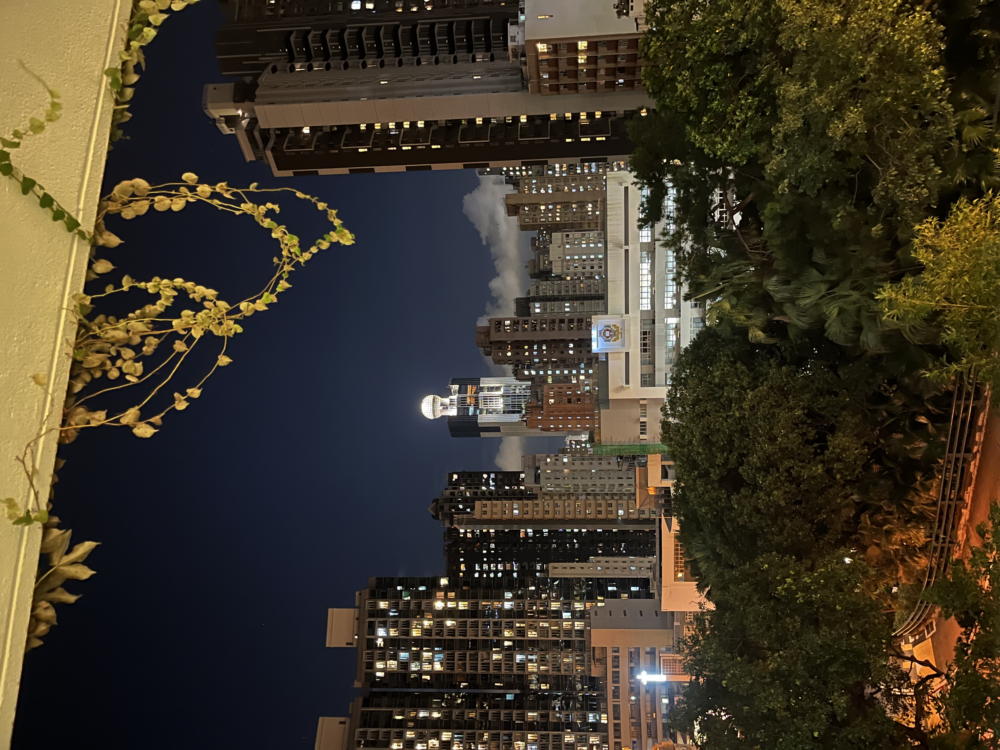

# 🌍 我的旅行足迹

### 四川成都

<table class="photo-table">
  <tr>
    <td>
      
      
三星堆博物馆

    </td>
    <td>
      
      
深圳夜景

    </td>
    <td>
      
      
成都宽窄巷子

    </td>
  </tr>
</table>

成都 | 2024年12月

---

### 深圳

深圳 | 2024年11月

---

### 香港

<table class="photo-table">
  <tr>
    <td>
      
      
三星堆博物馆

    </td>
    <td>
      
      
深圳夜景

    </td>
    <td>
      
      
成都宽窄巷子

    </td>
  </tr>
</table>

香港 

> ✈️ 旅行小贴士：最好的照片往往在计划外的小巷中发现
